# Secure API for LLM using FastAPI, JWT and OpenRouter

# LLM Proxy API

A REST API service for interacting with Large Language Models (LLMs) via OpenRouter, with user authentication, chat history storage, and session management.

The project is built with FastAPI and uses JWT authentication, SQLite, and a layered architecture inspired by Clean Architecture principles.

---

## Features

- User registration and authentication
- JWT-based authorization
- Sending prompts to a Large Language Model
- Chat history storage in database
- Retrieving chat history
- Clearing chat history
- Health check endpoint

---

## Technologies

- Python 3.11+
- FastAPI
- SQLAlchemy
- SQLite
- OpenRouter API
- Pydantic
- Uvicorn
- Ruff (linter)

---

## Project Structure

```text
app
├── api
│   ├── deps.py
│   ├── routes_auth.py
│   └── routes_chat.py
│
├── core
│   ├── config.py
│   ├── errors.py
│   └── security.py
│
├── db
│   ├── base.py
│   ├── models.py
│   └── session.py
│
├── repositories
│   ├── chat_messages.py
│   └── users.py
│
├── schemas
│   ├── auth.py
│   ├── chat.py
│   └── user.py
│
├── services
│   └── openrouter_client.py
│
├── usecases
│   ├── auth.py
│   └── chat.py
│
└── main.py
```

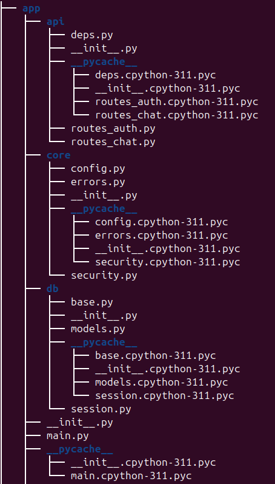

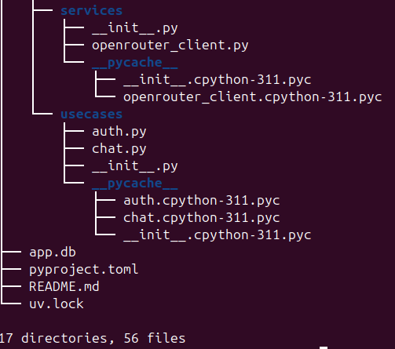

---

## Installation and Setup

### Extract the project archive

Download and extract the ZIP archive containing the project.

Example:

```bash
llm-p.zip → extract → llm-p/
```

Open the project directory in the terminal.

### Create a virtual environment

```bash
uv venv
```

Activate it:

**MacOS / Linux**

```bash
source .venv/bin/activate
```

**Windows**

```bash
.venv\Scripts\activate
```

### Install dependencies

```bash
uv pip install -e .
```

### Environment Variables

Create a `.env` file in the project root:

```env
APP_NAME=llm-proxy
ENV=dev

JWT_SECRET=supersecret
JWT_ALG=HS256
ACCESS_TOKEN_EXPIRE_MINUTES=60

SQLITE_PATH=./app.db

OPENROUTER_API_KEY=your_api_key_here
OPENROUTER_BASE_URL=https://openrouter.ai/api/v1
OPENROUTER_MODEL=mistralai/mistral-7b-instruct
OPENROUTER_SITE_URL=http://localhost:8000
OPENROUTER_APP_NAME=llm-proxy
```

You can generate an API key at:

https://openrouter.ai/keys

---

## Running the Server

Start the server:

```bash
uv run uvicorn app.main:app --reload
```

The API will be available at:

```text
http://127.0.0.1:8000
```

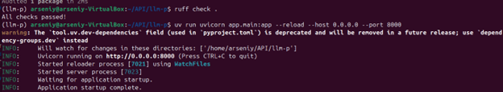

---

## API Documentation (Swagger)

Interactive API documentation is available at:

```text
http://127.0.0.1:8000/docs
```

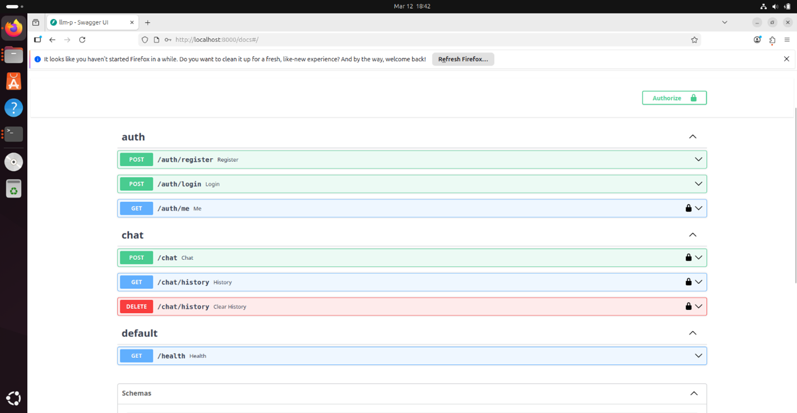

---

## Authentication

### Register User

**POST /auth/register**

Example request:

```json
{
  "email": "student_surname@email.com",
  "password": "password123"
}
```

⚠️ Important

The email must follow the format:

```text
student_surname@email.com
```

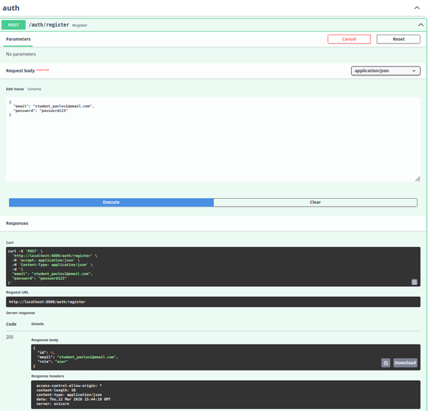


### Login

**POST /auth/login**

Uses OAuth2 password flow.

Example credentials:

```text
username: student_surname@email.com
password: password123
```

Response example:

```json
{
  "access_token": "JWT_TOKEN",
  "token_type": "bearer"
}
```

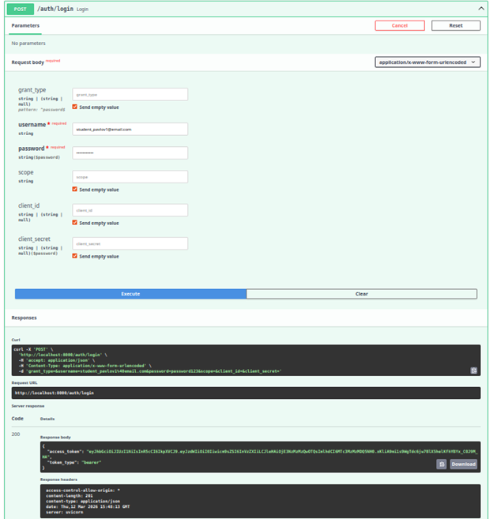


### Swagger Authorization

To access protected endpoints:

1. Click Authorize in Swagger
2. Insert the token

```text
Bearer <JWT_TOKEN>
```

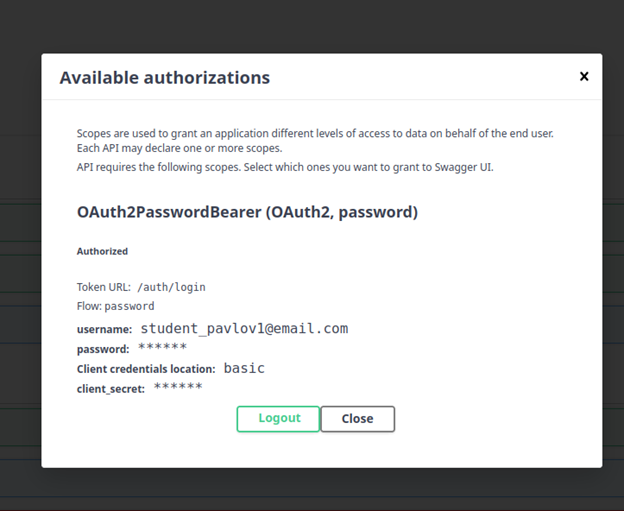

---

## Chat API

### Send Message to LLM

**POST /chat**

Example request:

```json
{
  "prompt": "Explain FastAPI simply",
  "temperature": 0.7
}
```

Response example:

```json
{
  "answer": "FastAPI is a modern Python web framework..."
}
```

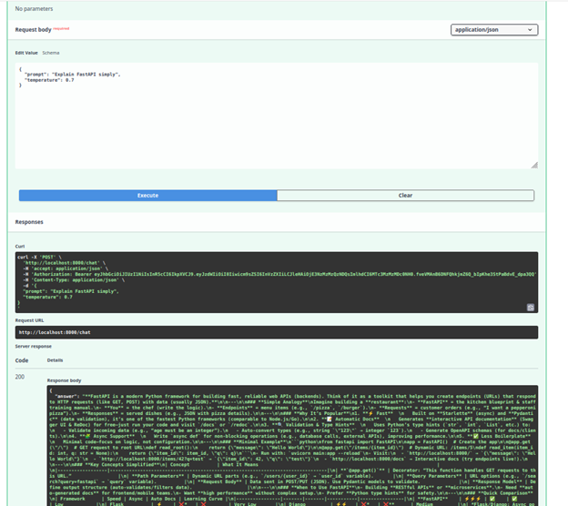

### Chat History

**GET /chat/history**

Returns the conversation history stored in the database.

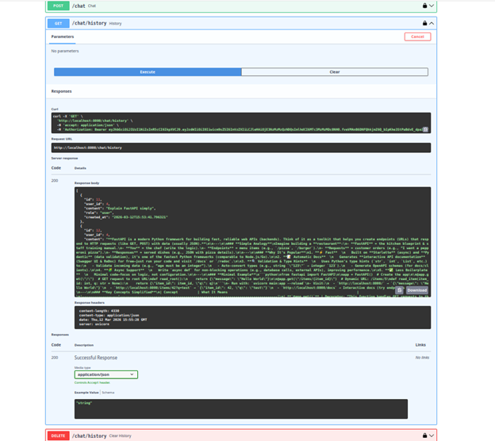

### Delete Chat History

**DELETE /chat/history**

Deletes all stored messages for the current user.

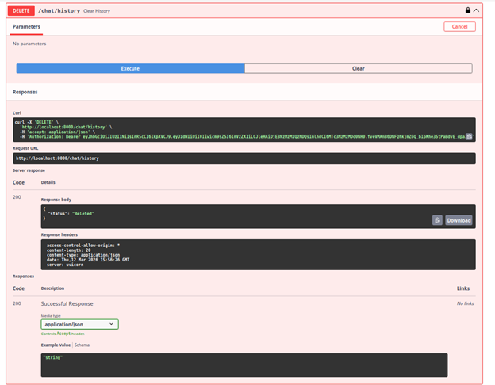

### Health Check

**GET /health**

Example response:

```json
{
  "status": "ok"
}
```

---

## Database

The project uses SQLite.

The database file is created automatically:

```text
app.db
```

To inspect the database:

```bash
sqlite3 app.db
```

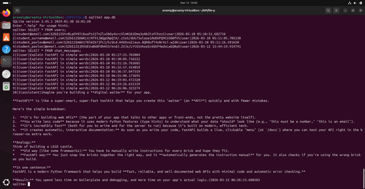

---

## Code Quality

Run linter:

```bash
ruff check .
```

Format code:

```bash
ruff format .
```

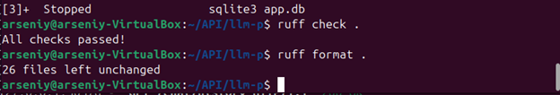

---

## Example Workflow

1. Register a new user
2. Login using `/auth/login`
3. Receive a JWT token
4. Authorize in Swagger
5. Send prompts to `/chat`
6. Check stored messages using `/chat/history`

---

## Architecture

The project is organized into multiple layers:

- **API layer** — Handles HTTP requests and responses.
- **UseCases layer** — Contains business logic of the application.
- **Repositories layer** — Handles database interactions.
- **Services layer** — Responsible for external API integrations (OpenRouter).
- **Core layer** — Contains configuration, security utilities, and shared components.

This structure follows simplified Clean Architecture principles.
